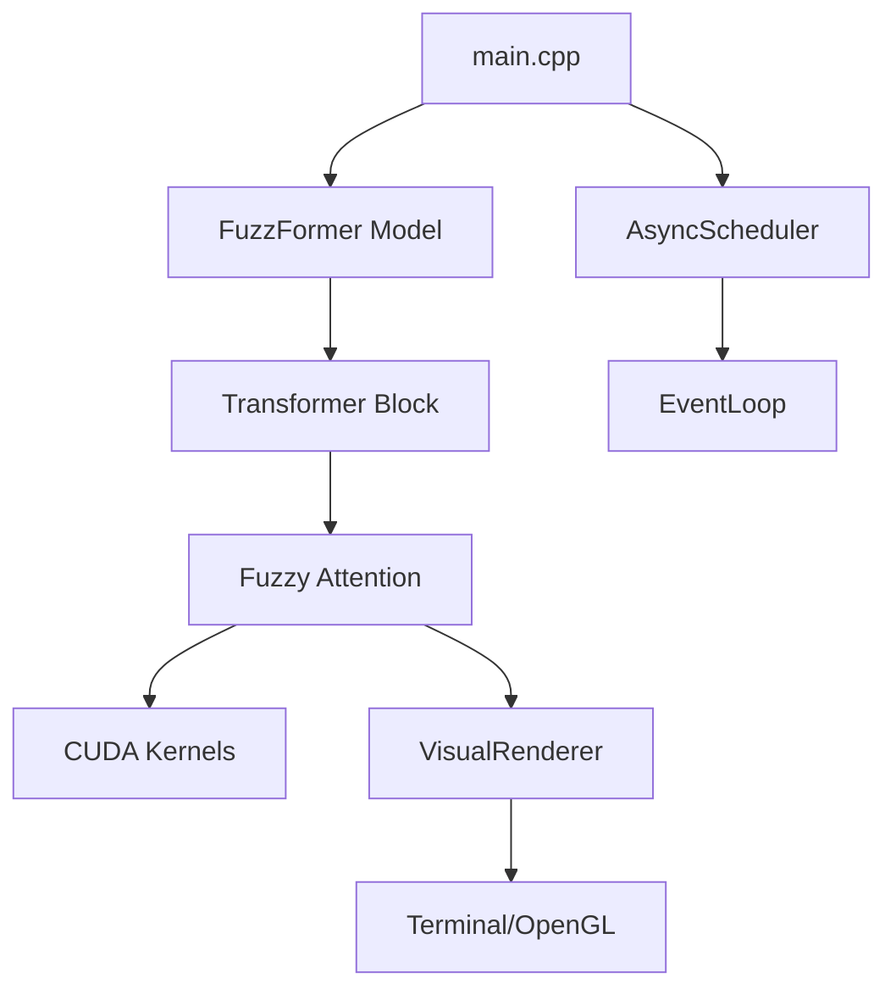
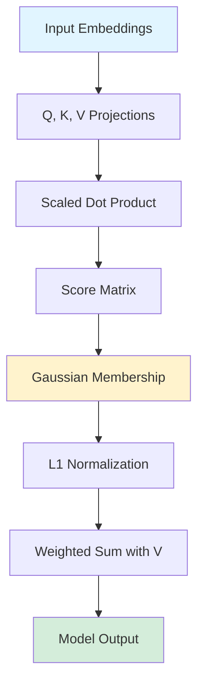
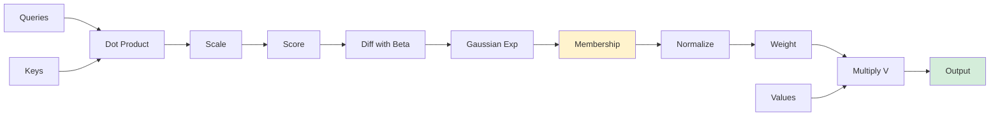
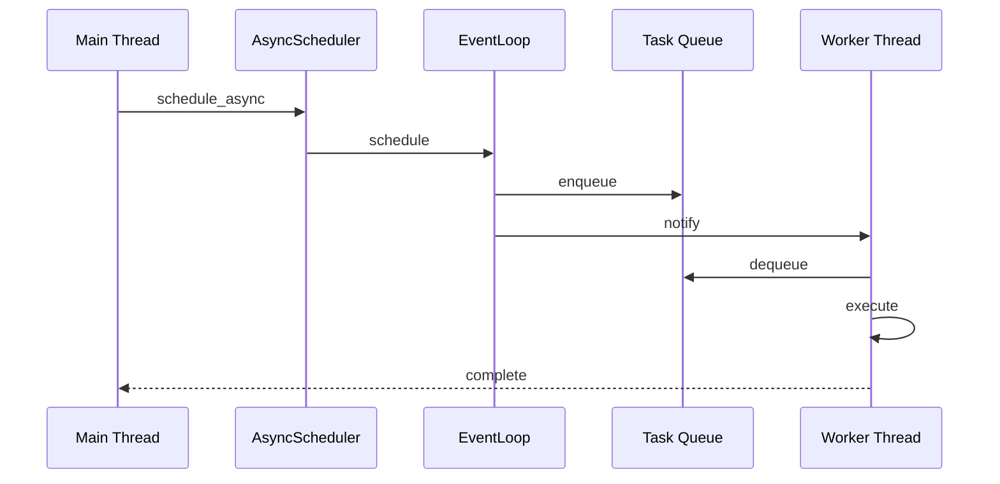
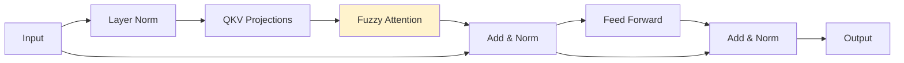

# FuzzFormer Architecture

## Overview

FuzzFormer is a native C++20 and CUDA research platform implementing fuzzy attention—an uncertainty-aware alternative to softmax attention in transformers. The system provides custom GPU kernels, asynchronous execution, and real-time visualization.

## System Components

### Core Compute (`src/core/`)
- **fuzzyAttention.cu**: CUDA kernels for forward/backward fuzzy attention
- **fuzzyAttention.cpp**: C++ bindings to libtorch
- **transformerBlock.cpp**: Transformer block with fuzzy attention
- **model.cpp**: Full model assembly

### Runtime (`src/runtime/`)
- **eventLoop.cpp**: libuv-based async event loop
- **asyncScheduler.cpp**: High-level task scheduler
- **metricsCollector.cpp**: Performance metrics with CUPTI integration

### Visualization (`src/visual/`)
- **terminalHeatmap.cpp**: ASCII heatmap renderer
- **renderer.cpp**: Tensor-to-heatmap conversion with OpenGL support

### Utilities (`src/utils/`)
- Tensor validation, timing, and logging utilities

## System Architecture

## Data Flow

## Fuzzy Attention Flow

## Async Execution

## Transformer Block

## Build & Test

- **CMake 3.22+**, **CUDA 12.0+**, **libtorch** (optional), **libuv** (required)

## Performance

- Kernel fusion opportunities
- Coalesced memory access
- 128 threads per block
- Tensor Core support (future)
