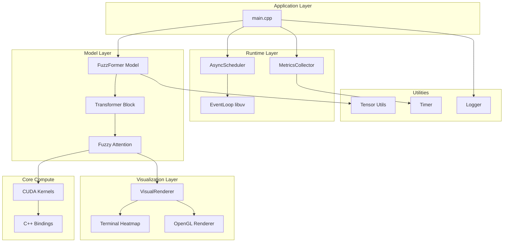
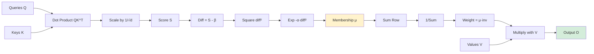
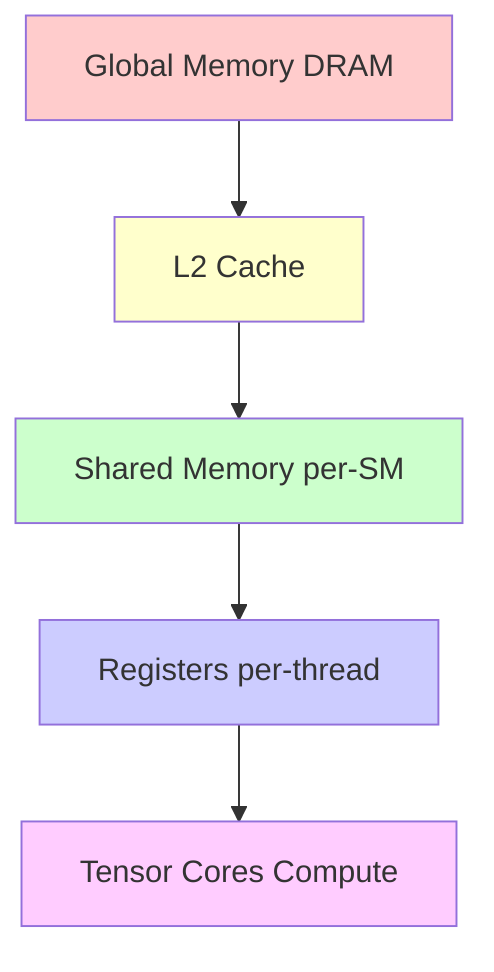
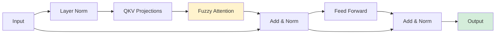
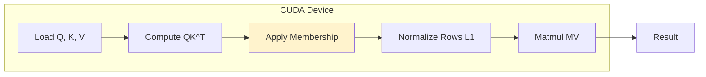
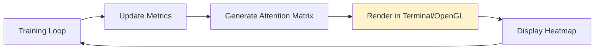
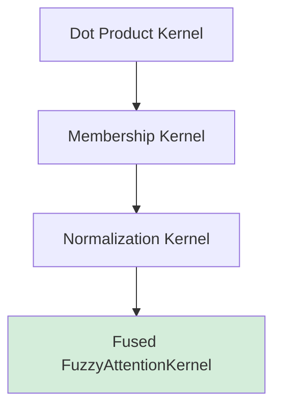

# FuzzFormer Architecture

## Overview

FuzzFormer is a native C++20 and CUDA research platform implementing fuzzy attention—an uncertainty-aware alternative to softmax attention in transformers. The system is designed as a full-stack research tool with custom GPU kernels, asynchronous execution, and real-time visualization.

## System Components

### 1. Core Compute Layer

**Location:** `src/core/`

- **fuzzyAttention.cu**: CUDA kernels implementing fuzzy attention forward and backward passes
  - Forward: Computes Gaussian membership functions, L1 normalization, weighted value aggregation
  - Backward: Gradient computation for Q, K, V, alpha, and beta parameters
  
- **fuzzyAttention.cpp**: C++ bindings connecting CUDA kernels to libtorch tensors
  - Input validation and tensor shape checking
  - CUDA stream management
  - Error handling and reporting

- **transformerBlock.cpp**: Transformer encoder block using fuzzy attention
  - Multi-head attention with fuzzy attention mechanism
  - Residual connections and layer normalization
  - Feed-forward network integration

- **model.cpp**: Full model assembly
  - Stacked transformer blocks
  - Input/output projections
  - Configurable architecture

### 2. Runtime Layer

**Location:** `src/runtime/`

- **eventLoop.cpp**: libuv-based asynchronous event loop
  - Task queue management
  - Non-blocking task execution
  - Thread-safe scheduling

- **asyncScheduler.cpp**: High-level async task scheduler
  - Wraps event loop in worker thread
  - Provides `schedule_async()` interface
  - Automatic cleanup on destruction

- **metricsCollector.cpp**: Performance metrics collection
  - Kernel timing measurement
  - Throughput card rendering
  - Extensible for CUPTI integration

### 3. Visualization Layer

**Location:** `src/visual/`

- **terminalHeatmap.cpp**: ASCII terminal heatmap renderer
  - 9-level intensity mapping (`. :-=+*#%@`)
  - 2D matrix and 1D vector visualization
  - Real-time attention weight display

- **renderer.cpp**: Tensor-to-heatmap conversion
  - libtorch tensor extraction
  - CPU transfer and formatting
  - Integration with heatmap renderer

### 4. Utilities

**Location:** `src/utils/`

- **tensorUtils.cpp**: Tensor validation and dimension checking
- **timer.cpp**: High-resolution timing utilities
- **logger.cpp**: Thread-safe logging with severity levels

## System Architecture



## Data Flow

```mermaid
flowchart TD
    Input[Input Embeddings] --> Stack[Transformer Block Stack]
    Stack --> QKV[Q, K, V Projections]
    QKV --> Dot[Scaled Dot Product QK^T]
    Dot --> Score[Score Matrix S]
    Score --> Gaussian[Gaussian Membership μ = e^(-α(S-β)²)]
    Gaussian --> Norm[L1 Normalization]
    Norm --> Weight[Weighted Sum with V]
    Weight --> Output[Output O]
    Output --> Proj[Output Projections]
    Proj --> Result[Model Output]
    
    style Input fill:#e1f5ff
    style Result fill:#d4edda
    style Gaussian fill:#fff3cd
```

## Fuzzy Attention Flow



## Memory Hierarchy



## Async Execution Model

```mermaid
sequenceDiagram
    participant Main as Main Thread
    participant Sched as AsyncScheduler
    participant Loop as EventLoop libuv
    participant Queue as Task Queue
    participant Worker as Worker Thread
    
    Main->>Sched: schedule_async(task)
    Sched->>Loop: schedule(task)
    Loop->>Queue: enqueue(task)
    Loop->>Worker: uv_async_send()
    Worker->>Queue: dequeue(task)
    Worker->>Worker: execute(task)
    Worker-->>Main: task complete
```

## Transformer Block Layout



## Compute Pipeline



## Visualization Loop



## Kernel Fusion Flow



## Build System

- **CMake 3.22+**: Build configuration
- **CUDA 12.0+**: GPU kernel compilation
- **libtorch**: Optional model execution (stubs when unavailable)
- **libuv**: Async event loop (required)
- **GoogleTest**: Test framework

## Testing Strategy

- **Unit Tests**: Individual component validation
- **Integration Tests**: End-to-end model inference
- **Performance Tests**: Kernel timing and throughput
- **Skip Logic**: Tests requiring libtorch skip gracefully when unavailable

## Extension Points

1. **CUPTI Integration**: Add to `metricsCollector.cpp` for detailed GPU profiling
2. **OpenGL Renderer**: Extend `visualRenderer.h` for real-time 3D visualization
3. **Additional Kernels**: Add new CUDA files following `fuzzyAttention.cu` pattern
4. **Custom Optimizers**: Extend model training loop in `main.cpp`

## Performance Considerations

- **Kernel Fusion**: Forward and backward passes are separate kernels (can be fused)
- **Memory Access**: Coalesced global memory access patterns
- **Occupancy**: 128 threads per block, configurable
- **Tensor Cores**: Architecture supports Tensor Core operations (future optimization)

